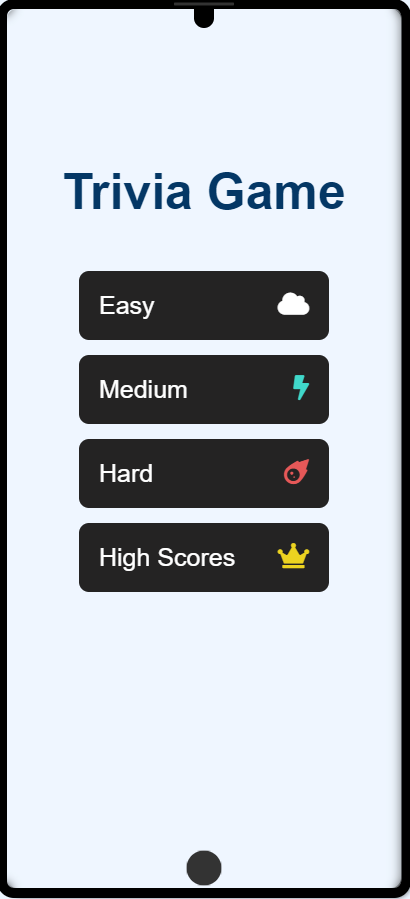

# Challenge-Trivia-Game
Trivia Game with Vanila Javascript, Html and Css.
It has 3 modes (easy, medium, and hard).
User scores are stored in localstorage and displayed with the diffuculty mode in the highscore page .
This code is free to use.
this is a chellenge from my coding bootcamp please leave suggestion and/or requests. Thank you!

